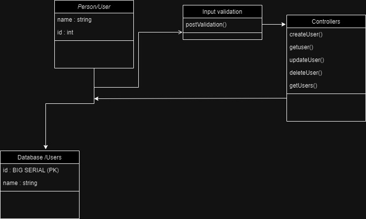

# HNG stage 2 backend

**RESTful API for Managing Persons or Users**

## Table of Contents

1. [Introduction](#introduction)
2. [API Endpoints](#api-endpoints)
3.  [Setup Instructions](#setup-instructions)
4. [Folder Structure](#folder-structure)

5. [Database Structure and UML Diagram](#database-structure)

6. [Testing](#testing)
7. [Dynamic Parameter Handling](#dynamic-parameter-handling)
8. [GitHub Repository](#github-repository)
9. [Hosting](#hosting)
10. [Known Limitations](#known-limitations)

---

## 1. Introduction

### Overview

This RESTful API allows you to perform CRUD operations on a "person" resource or "user" as named in this project. It interfaces with a PostgreSQL database and provides flexible parameter handling. The API follows industry best practices for security, including protection against common vulnerabilities like SQL injection by using Pg library. 

### NOTE 
*** The pg library prevents SQL injections by allowing parameterized query or using parameters in the database query***

### Technologies Used

- Node.js
- Express.js
- PostgreSQL
- Pg
- Postman
- joi
- UML diagrams (for system design)

## 2. API Endpoints

### Create a New Person

- **Endpoint:** `/api`
- **HTTP Method:** POST
- **Request Format:**
  - Body: JSON object containing person details (name etc.)

**Sample Request:**

```json
POST /api
// request body below
{
  "name": "John Doe"
}
```
***Response***
```
//response value
{
message:"success",
status:201
}
```

### Update a Person
**User_id can be name or id of the person/user in the database**
- **Endpoint:** `/api/:user_id`
- **HTTP Method:** PATCH
- **Request Format:**
  - Body: JSON object containing person details (name etc.)
  - URL: request URL contains the name or id of the saved person/user as a parameter/params

**Sample Request:**

```json
PATCH/api/user_id
{
  "name": "John Doe"
}
```
***Response***
```
//response value
{
message:"success",
status:204
}
```
### Remove a Person
**User_id can be name or id of the person/user in the database**
- **Endpoint:** `/api/:user_id`
- **HTTP Method:** DELETE
- **Request Format:**
  - URL: request URL contains the name or id of the saved person/user as a parameter/params

**Sample Request:**

```json
DELETE/api/user_id
{
  "name": "John Doe"
}
```
***Response***
```
//response value
{
message:"success",
status:204
}
```

### Get a Person
**User_id can be name or id of the person/user in the database**
*This returns the user whose name or Id is passed in the params or as params in the URL*
- **Endpoint:** `/api/:user_id`
- **HTTP Method:** GET
- **Request Format:**
 - URL: request URL contains the name or id of the saved person/user as a parameter/params

**Sample Request:**

```
GET/api/user_id

//below are examples of how the request URL should look

baseURL/api/id

//or

baseURL/api/name

```
***Response***
```
//response value
{
message:"success",
status:200,
payload: user
}
```
### Get all Persons or Users

- **Endpoint:** `/api`
- **HTTP Method:** GET
- **Request Format:**
 - URL: request URL contains only a path named "api"

**Sample Request:**

```
GET/api

//below are examples of how the request URL should look

baseURL/api

```
***Response***
```
//response value
{
payload: users,
status:200,
payload:user
}
```

## 3. Setup and installation

### prerequisites
- Node
- Postgresql

Clone the repository and run
```
//if you are using npm as your package manager 
 npm install
 //if you are using yarn as your package manager
 yarn install 
  ```
  Add or setup your database by specifying port and other values in the .env file

To startup the server run
```
//if you are using npm as your package manager 
 npm run dev
 //if you are using yarn as your package manager
 yarn dev 
  ```
1. The API will be accessible at `http://localhost:2000` by default.

## 4. Folder structure
The project follows a modular folder structure to keep the code organized:

-   **db**: Database configuration, input validation configuration and migration scripts.
-   **controllers**: Contains controller logic for handling API requests.
-   **utils**: Utility functions and helper modules.
-   **models**: Defines data models for interacting with the database.
-   **middlewares**: Custom middleware functions.
-   **routes**: Defines API routes and endpoints.


## 5. Database Structure / UML Diagram
- UML diagram
**The UML diagram can be found in the assetes folder './assets/backend.jpg' or as a draw.io file in the root folder**



## 6. Testing

### Postman Tests

-   Use Postman to run tests for each CRUD operation.
-   Add a new person, fetch person details, modify details, and remove a person.
-   Ensure tests cover various scenarios and edge cases.

## 7. Dynamic Parameter Handling

-   The API handles dynamic input for operations using the person's name or Id.
-   Validation ensures that only strings are allowed for person details

## 8. GitHub Repository

-   The project is hosted on GitHub at [GitHub Repository Link](https://github.com/nitoC/zuriStage1/tree/second-stage).

### Sample API Usage

-   Include sample usage scenarios with example requests and expected responses for each CRUD operation.

## 9. Hosting

-   visit the link to test out the hosted version of the api `[https://yourdomain.com/api](https://backendhng.onrender.com/api)`
-   baseURL is https://backendhng.onrender.com
## 10. Known Limitations / assumptions

-   The name "tolu emmanuel" is not the same as "tolu  emmanuel" (with an extra space  in between). The api makes provision to add first name and last name together seperated by a space but does not handle number of spaces. if the number of spaces separating them is not equal then matching won't take place when querying the database by name.
- The user must have a unique name before saving can be done in the database, which can be resolved by adding fullname with the firstname, middlename and lastname separated with spaces.
